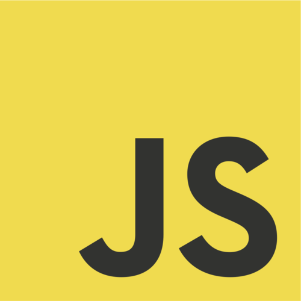
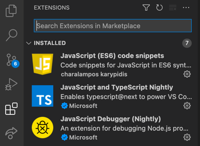

# backend-30960


En este repositorio van a poder acceder a todos los ejercicios de la clase hechos por el profesor

## Glosario de clases

* [Clase 1](./clase-1) Variables y Tipos de variables
* [Clase 2](./clase-2) Funciones, Scope, Template Strings y Clases
    * [Ejercicio 1](./clase-2/4-ejercicio1) Funciones, scope y template strings
    * [Ejercicio 2](./clase-2/6-ejercicio-2) Clases
* [Clase 3](./clase-3) Arrow Functions, Promise, Async
* [Clase 4](./clase-4) Delays, File Sync, File Async (Read, Write, Append, etc)
    * [Ejercicio 1](./clase-4/2-ejercicio-1/) Mostrar Letras con timers
    * [Ejercicio 2](./clase-4/4-ejercicio-2/) Mostrar Fecha y Hora Sincrono
    * [Ejercicio 3](./clase-4/6-ejercicio-3/) Guardar package.json
    * [Ejercicio 4](./clase-4/7-ejercicio-4/) Modificar Objeto package.json e imprimir Asincrono
* [Clase 5](./clase-5) Node.js, NPM, package.json
    * [Ejercicio 1](./clase-5/2-ejercicio-1/) 10000 numeros random y return Objeto con los numeros
    * [Ejercicio 2](./clase-5/3-ejercicio-2/) Productos, getNombres, Precios, Promedios
    * [Ejercicio 3](./clase-5/5-ejercicio-3/) Moment, Dias de hoy a mi nacimiento
* [Funny JS](./funny-JS) Cosas curiosas de JavaScript

## Instalacion Visual Studio Code
(Sos libre de utilizar cualquier IDE o editor de 
texto pero para estar alineado con la clase, 
sugerimos utilizar VSCode que es el que se utilizara 
en las clases)

* [Pagina de VSCode](https://code.visualstudio.com/download)

Algunas extensiones de VSCode para programar en JavaScript



## Instalacion Node

### Windows

* [Pagina de Node](https://nodejs.org/es/download/)

Descargar archivo y seguir los pasos de instalacion

(Recomendacion: Descargar version LTS que es la mas estable)

### Mac/Linux

#### Opcion 1:

* [Pagina de Node](https://nodejs.org/es/download/)
 #### Opcion 2:

```shell
brew install node
```

### Ejecutar con Node

En la terminal, estar parados en la carpeta donde esta el 
archivo que queremos ejecutar. (Suponiendo que el archivo
se llama main.js)

```shell
node index.js
```

## NPM

### Que es NPM?

NPM es el administrador de paquetes de NodeJS y nos sirve 
para instalar las librerias o dependencias que tenga
nuestro proyecto.

### Comandos de NPM

#### Crear proyecto con NPM

```
npm init           Create a package.json file
                   [--force|-f|--yes|-y|--scope]
```

#### Instalar Dependencias
```
npm install        install all the dependencies in your project
npm install <foo>  add the <foo> dependency to your project
                   [-g] (instalar dependencias global)
                   @version (1.0.0 o latest)
```

#### Ejecutar o testear con NPM
```
npm run <foo>      run the script named <foo>
npm test           run this project's tests
```

## Profesor
### Marcos Villanueva
#### marcosvillanueva009@gmail.com
